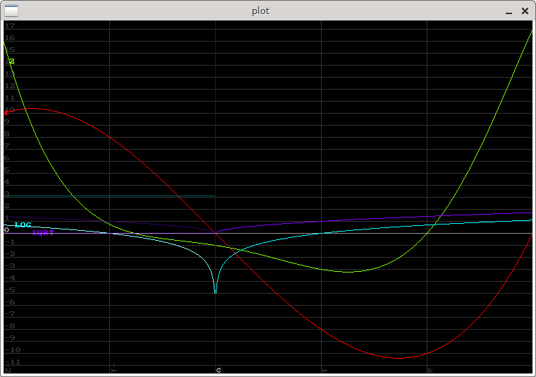

A simple program to transform lisp functions into pixels.

Place into ~/common-lisp/ and load with (ql:quickload "plot")

		Lambda-list: (func-list
			      &key (from 0) (to 100) wire-density plot-type slack pitch yaw
				(window-width 500) (window-height 500)
				bindings)

		Documentation:
		  FUNC-LIST = ({fun|(fun[fun]*)}*)
		  FUN = function|(function[func-options])

		  Subsequent functions given after an inner function list are post-processing
		  functions which should always take only the result of their master function,
		  which will not be drawn.

		  FUNC-OPTIONS is a &rest property-list. Valid keys at the moment are
		  :data-per-pixel, a positive non-zero real
		  values less than 1 reduce rendering time with loss of accuracy,
		  values greater than 1 might help spot erratic line behaviour.
		  :arg-count, either 1 or 2
		  Specifies number of arguments to be given to a master function, to be used for
		  functions with optional number of arguments or if automatic arg count detection
		  craps out.

		  The FROM and TO values may be given either as reals or a list of two reals.

		  PLOT-TYPE specifies plotting style.
		  Defaults are '2d-plot-with-grid and 'wireframe-with-grid
		  Other valid types: '2d-state for a gridless 2d plot
		  'heatmap 'sequential-heatmap 'wireframe for 3d plots.

		  WIRE-DENSITY should be a RATIONAL between 0 and 1
		  best results between ~ 1/50 and 1/10. Denominator+1 lines will be drawn
		  for both dimensions. Only has an effect on wireframe 3d plots.

		  SLACK adds (slack/2 * value-range) to a 2d plot grid's maximum and minimum.

		  PITCH and YAW set initial pitch and yaw for wireframe plots in radians.

		  BINDINGS = ((inc-button dec-button dynamic-var delta [function*])*)
		  Binds inc & dec buttons to increment and decrement dynamic-var by delta.
		  Delta may be either a real or a function of zero args producing a number.
		  Giving named function arguments (of type function) as &rest will ensure only
		  these functions will be recomputed.

		  Some states come with basic controls predefined.
		  2d-plots will have left and right arrow keys modify min & max x.
		  3d-plots can rotated with arrow keys.
---

    (plot:plot (list #'(lambda (x) (- (expt x 3) (* 9 x)))
                     #'(lambda (x) (- (expt x 4) (expt 4 x)))
                     'log
                     'sqrt)
               :from -2 :to 3
               :window-width 750
               :window-height 500)

    (plot:plot (list #'(lambda (x y)
                         (exp (- (+ (/ (expt x 2) 1)
                                    (/ (expt y 2) 1))))))
               :from '(-3 -3) :to '(3 3)
               :wire-density 1/30
               :window-width 550)

    (plot:plot (list #'(lambda (x y)
                         (* (sin (expt x 2))
                            (cos (expt y 2)))))
               :from -4 :to 4
               :plot-type 'heatmap)

